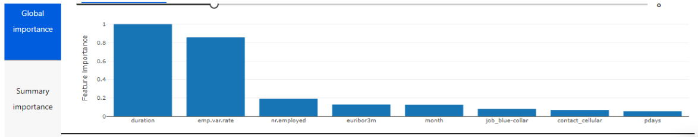

# Optimizing an ML Pipeline in Azure

## Overview
This project is part of the Udacity Azure ML Nanodegree.
In this project, we build and optimize an Azure ML pipeline using the Python SDK and a provided Scikit-learn model.
This model is then compared to an Azure AutoML run.

## Summary
This dataset contains data about bank marketing campaigns. Usually marketing campaigns are based on phone calls. Often, more than one contact to the same client was required, in order to access if the product (bank term deposit) would be ('yes') or not ('no') subscribed. We seek to predict if the client will subscribe a term deposit i.e. 'y'.

The best performing model was Voting Ensemble model developed by AutoML with accuracy of 0.9177, the graph shows the top 8 features the model used in predicting whether the client will subscribe a term deposit or not.

## Scikit-learn Pipeline

* Simple overview of how the pipeline architecture works:
    - The snapshot of folder is sent to experiment (Azure ML).
    - Create docker image.
    - Deploy docker and snapshot to compute.
    - Mount datastore to compute.
    - Launch script (training).
    - Stream logs, metrics, stdouts.
    - Copy output after finishing job (experiment).

For training, train.py script was written (used only for Hyperdrive). In this file we used LogisticRegression. In train.py, we load data, clean it, and then perform training using sklearn logistic regression. Hyperdrive will choose the best parameter among combinations.

We choose 'RandomParameterSampling' which uses random sampling over a hyperparameter search space. It help us in tuning discrete hyperparameter like 'max_iter' and uniform distribution like 'C' (Inverse of regularization strength).

We used 'BanditPolicy' for early stopping policy as it will help in stooping the experiment if metric falls below certain threshold (slack_factor).

## AutoML
AutoML is advanced tool in Azure which let's our work much easier. AutoML search through all algorithms (unless blacklisted) and find the best one. 

-   The basic configuration of AutoML that we used are:
    - timeout to 30 minutes (due to resource limitations)
    - primary metric was "accuracy"
    - cross validation set to 5 to avoid overfitting.
    - task name was "classification".
    - data in which target column name is "y".

AutoML tries a lot of algorithm and the best model was "VotingEnsemble" having accuracy of "0.9177". It generates 21 metric values like "AUC_weighted", "weighted_accuracy", etc. It also creates confusion matix and accuracy table. We can use these metrics to gain a lot of insights. We can also see model's explanation like top "x" feature. 

## Pipeline comparison
AutoML performs slightly better than HyperDrive in accuracy by 0.01. The best model choosed by AutoML was VotingEnsemble.

Architecture wise both are different, but idea is same. The main advantage of AutoML is that we have many possibilities to increase search of better algorithm and hyperparameters.

In AutoML, it provides warnings for class imbalance and data checks. It also provides top features to select best model. AutoML also imputes missing feature values.

While in Hyperdrive, we only build one model which we think is best and tune it's hyperparameters (those which we think is best).

AutoML provides a wide variety of models and preprocessing steps whic is not there in Hyperdrive.

## Future work
In future experiments I will try other primary metrics like 'AUC', 'weighted accuracy', etc. Accuracy is basic metric and it is useful to take other metrics too, to gain more insights. "AUC" gives the arithmetic mean of the score for each class, weighted by the true number of true instances in each class.

Also we can try other hyperparameters of AutoML like increase number of cross-validation.

As increase timeout duration was capped to 30 minutes so there could only be a limited number of models that can be runned on that time period, so a longer timeout could have greater number of models to run and thus improving the performance.  